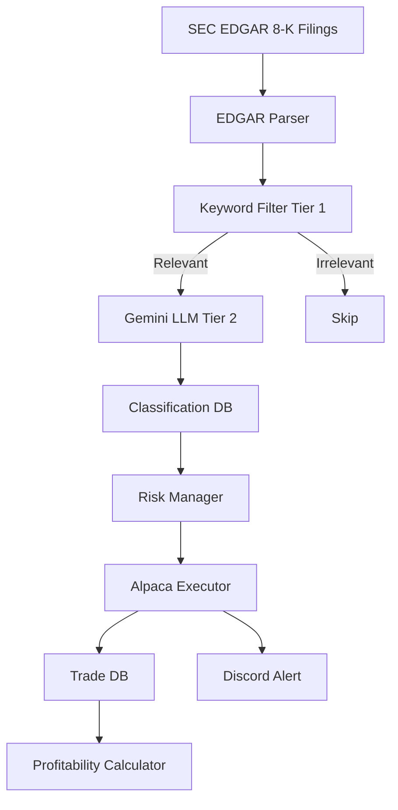

# Architecture Documentation

Deep dive into the system architecture, data flow, and design decisions.

## High-Level Architecture



## Three-Tier Pipeline

### Tier 0: Data Sources

**SEC EDGAR 8-K Filings**
- **Why**: Legally required disclosures, first place material info appears publicly
- **Latency**: Near real-time (filings appear within minutes of submission)
- **Cost**: Free, no API key required (just User-Agent header)
- **Format**: JSON API at `data.sec.gov/submissions/CIK{number}.json`

**Implementation**: `src/data/edgar_8k.py`
- Polls each ticker's CIK every 60 seconds
- Extracts 8-K filings from last N days
- Fetches filing text (truncated to 5000 chars to save LLM tokens)
- Stores in `news_events` table with dedup by accession number

### Tier 1: Keyword Filter (Cost: $0)

**Purpose**: Eliminate 70-80% of irrelevant headlines before any LLM call.

**Implementation**: `src/analysis/keyword_filter.py`
- Compiled regex patterns for 3 keyword sets:
  - **Positive**: "Phase 3", "FDA Approval", "Primary Endpoint Met", etc.
  - **Negative**: "CRL", "Clinical Hold", "Failed Endpoint", etc.
  - **Competitive**: "Price War", "Generic", "Biosimilar", etc.
- Scoring: Negative keywords score 30 points, positive 20, competitive 25
- Threshold: Only headlines with score ≥ 15 proceed to Tier 2

**Why This Works**: Most 8-K filings are routine (board changes, financial reporting). Only ~10-20% contain biotech catalyst keywords. This filter saves ~$0.0005 per irrelevant headline.

### Tier 2: Gemini LLM Classification

**Purpose**: Extract structured information from biotech headlines.

**Implementation**: `src/analysis/gemini_classifier.py`
- Model: Gemini Flash (free tier: 60 RPM, 1M TPM)
- Fallback chain: 2.0-flash → 2.0-flash-lite → 2.5-flash-lite → 2.5-flash
- Prompt: Structured JSON output with category, sentiment, confidence, affected tickers
- Output: `{"category": "...", "sentiment": "...", "confidence": 95, "affected_tickers": ["LLY", "NVO"]}`

**Cost Controls** (`src/analysis/cost_guard.py`):
- Daily cap: 100 calls/day (hard limit)
- Dedup: SHA-256 hash of headline, skip if already classified
- Token limits: Max 300 output tokens per call

**Why Gemini Over FinBERT**: FinBERT is built for general corporate finance text — earnings calls, 10-Ks — and lacks the medical and biochemical vocabulary needed to parse clinical trial endpoints. Researchers have built separate biomedical sentiment models (e.g., GAN-BioBERT — see [Frontiers in Digital Health, 2022](https://www.frontiersin.org/journals/digital-health/articles/10.3389/fdgth.2022.878369/full)) precisely because the general financial models underperform on trial language. Gemini Flash costs ~$0.0005 per call and is significantly stronger on domain-specific text.

### Tier 3: Trade Decision Engine

**Purpose**: Convert classifications into executable trades.

**Components**:

1. **Risk Manager** (`src/trading/risk_manager.py`)
   - Position sizing: 5% max per trade, scaled by confidence (30-100%)
   - Sentiment scaling: Strong signals get full allocation, weak get 60%, neutral get 30%
   - **Dynamic stop-loss** based on market cap + volatility:
     - Large cap, low vol: 8% (LLY, AMGN, GILD)
     - Large cap, medium vol: 10% (VRTX, REGN)
     - Mid cap, high vol: 15% (CRSP)
   - Take-profit: 2x stop-loss (maintains 2:1 reward:risk ratio)
   - Daily loss limit: Stop trading if unrealized P&L < -2%
   - Max positions: 5 concurrent

2. **Executor** (`src/trading/executor.py`)
   - Direct HTTP calls to Alpaca REST API (avoids websocket version conflicts)
   - **IOC orders by default** (Immediate or Cancel) - prevents slippage on low-volume biotech
   - Market and limit orders supported
   - Logs order ID, price, quantity, fill status

3. **Slippage Logger** (`src/trading/slippage_log.py`)
   - Async thread waits 30 seconds after signal
   - Records price difference (signal price vs. 30s later)
   - Estimates real-world slippage for backtesting

## Database Schema

**SQLite** (`data/biotech_bot.db`)

### Tables

1. **`news_events`**
   - Raw 8-K filings from EDGAR
   - Fields: `id`, `timestamp`, `ticker`, `headline`, `filing_type`, `accession_number`, `raw_text`

2. **`classified_events`**
   - LLM classification results
   - Fields: `id`, `news_id`, `category`, `sentiment`, `confidence`, `affected_tickers`, `model_used`, `token_count`

3. **`headline_hashes`**
   - Dedup tracking (SHA-256 hash → news_id)
   - Prevents re-classifying same headline

4. **`llm_usage`**
   - Daily LLM call counter
   - Fields: `date`, `model`, `call_count`, `total_input_tokens`, `total_output_tokens`

5. **`trades`**
   - Trade journal
   - Fields: `id`, `news_id`, `classified_id`, `ticker`, `side`, `qty`, `price`, `order_id`, `pnl`, `slippage_price_at_signal`, `slippage_price_after_30s`

## Data Flow

### 1. Ingestion Cycle

```
Every 60 seconds:
  1. For each ticker in watchlist:
     a. GET https://data.sec.gov/submissions/CIK{number}.json
     b. Parse JSON, extract 8-K filings from last N days
     c. For each new filing:
        - Check if accession_number already in DB (dedup)
        - If new: INSERT into news_events
        - Fetch filing text (if fetch_text=True)
```

### 2. Classification Cycle

```
For each new news_event:
  1. Keyword filter (Tier 1)
     - If score < 15: Skip, mark as irrelevant
     - If score ≥ 15: Proceed
  2. Cost guard check
     - If daily limit hit: Skip
     - If headline hash exists: Skip (already classified)
  3. Gemini classification (Tier 2)
     - Try models in fallback order
     - Parse JSON response
     - INSERT into classified_events
     - INSERT hash into headline_hashes (dedup)
     - Increment llm_usage counter
```

### 3. Trading Cycle

```
For each classified_event:
  1. Determine trade side (buy/sell/skip) from sentiment
  2. Get current price from Alpaca
  3. Calculate position size (risk_manager)
  4. Check risk limits (daily loss, max positions)
  5. Submit order to Alpaca
  6. INSERT into trades
  7. Start slippage logger (async)
  8. Send Discord alert
```

## Cross-Company Detection

**Problem**: HIMS announces $49 compounded Wegovy. News is about HIMS, but LLY and NVO drop 7%.

**Solution**: Gemini prompt explicitly asks:
> "Which other tickers in the GLP-1 / obesity / same therapeutic area would be affected?"

The LLM returns `affected_tickers: ["HIMS", "LLY", "NVO"]`, and the bot trades all three.

**Implementation**: `config/watchlist.yaml` defines therapeutic area groupings:
```yaml
therapeutic_areas:
  "GLP-1 / Obesity":
    - LLY
    - NVO
    - HIMS
```

The LLM uses this context to identify competitors.

## Cost Optimization Strategy

### Why This Architecture Minimizes Costs

1. **Tier 1 Filter**: Eliminates 70-80% of headlines → saves ~$0.0005 × 80% = $0.0004 per headline
2. **Dedup**: Prevents re-classifying same headline → saves $0.0005 per duplicate
3. **Gemini Free Tier**: 60 RPM, 1M TPM → sufficient for 10-20 classifications/day
4. **Model Fallback**: If free tier exhausted, falls back to paid models only when necessary

### Estimated Monthly Cost

- **Best case** (free tier): $0/month
- **Worst case** (free tier exhausted): ~$0.50-1.00/month (Gemini Flash: $0.075/1M input tokens)

At paper trading volume, you'll stay in free tier.

## Research Foundation

The architecture is informed by peer-reviewed research:

1. **FinBERT does not handle biotech text well.** General financial sentiment models miss clinical and biochemical vocabulary, which is why biomedical-specific models like GAN-BioBERT were built. → Skip FinBERT, use Gemini Flash. Source: [Validating GAN-BioBERT — Frontiers in Digital Health, 2022](https://www.frontiersin.org/journals/digital-health/articles/10.3389/fdgth.2022.878369/full).
2. **Asymmetric returns.** Median announcement-day abnormal returns: +0.8% on positive events vs. -2.0% on negative (~2.5x downside). → Negative bias in keyword scoring. Source: [Stock Market Returns and Clinical Trial Results — PLOS ONE](https://journals.plos.org/plosone/article?id=10.1371%2Fjournal.pone.0071966).
3. **Pre-announcement run-up.** Companies reporting positive Phase III oncology trials were already up 13.7% on average in the 120 trading days before public announcement. → Focus on speed (EDGAR is the fastest public source), but accept that most alpha is captured before the public filing. Source: [Rothenstein et al., 2011 — PubMed 21949081](https://pubmed.ncbi.nlm.nih.gov/21949081/).
4. **Cross-company effects.** Large-cap pharma not immune to competitive shocks (e.g., LLY -7% on HIMS news, Feb 2026). → LLM must identify competitors in the same therapeutic area. Observational.

## Scalability Considerations

### Current Limits

- **Polling**: 60-second intervals (configurable)
- **Daily LLM calls**: 100 (hard cap)
- **Max positions**: 5 concurrent
- **Database**: SQLite (sufficient for months of paper trading)

### Future Enhancements (v2)

- PostgreSQL migration for multi-instance deployment
- Options flow monitoring (Unusual Whales) as Tier 0.5 filter
- Scientific abstract analysis (leverage biomedical background)
- Cross-company knowledge graph (automate competitor detection)

## Security Considerations

- **API Keys**: Stored in `.env` (gitignored)
- **SEC EDGAR**: No auth required, but User-Agent header required (polite scraping)
- **Alpaca**: Paper trading only (no real money at risk)
- **Database**: Local SQLite file (not exposed to network)

## Error Handling

- **API Failures**: Retry with exponential backoff (for 503 errors)
- **JSON Parse Errors**: Log raw response, skip classification
- **Order Failures**: Log error, continue processing other signals
- **Database Errors**: Transaction rollback, log error

All errors are logged to console and sent to Discord (system alerts).
